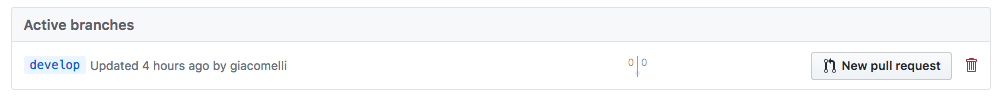

| Branch  | Status  | 
|---|---|
| master  | [](https://ci.appveyor.com/project/giacomelli/jogosdaqui-github-io-jekyll/branch/master)  | 
| develop  | [](https://ci.appveyor.com/project/giacomelli/jogosdaqui-github-io-jekyll/branch/develop)  | 


Site Jekyll utilizado para gerar o [https://jogosdaqui.github.io](https://jogosdaqui.github.io).

Todos os pull requests e issues para melhoria do jogosdaqui devem ser abertos nesse repositório, pois o [https://github.com/jogosdaqui/jogosdaqui.github.io](https://github.com/jogosdaqui/jogosdaqui.github.io) é utilizado apenas para publicar o resultado do site gerado pelo Jekyll.

A publicação é feita automaticamente via AppVeyor toda vez que o branch master é atualizado.

--------

# Colaborando via pull-request
###  Crie um fork 
Crie um fork do [https//github.com/jogosdaqui/jogosdaqui.github.io-jekyll](https://github.com/jogosdaqui/jogosdaqui.github.io-jekyll/fork).

### Clone o repositório
Abra um terminal/console e digite: 

```shell
git clone https://github.com/username/jogosdaqui.github.io-jekyll.git
cd jogosdaqui.github.io-jekyll
```
> Onde `username` é o seu username no GitHub

### Faça checkout do branch `develop`
```shell
git checkout develop
```
### Realize as alterações
Veja no FAQ abaixo dicas de como realizar determinadas alterações.
 
### Instale o Jekyll
> Se você ainda não tem o Jekyll instalado na sua máquina siga os passos abaixo: 
 
* [Instale um ambiente de desenvolvimento Ruby](https://jekyllrb.com/docs/installation/)
* Instale o Jekyll
 
```shell
gem install jekyll bundler
```
* Mais detalhes em: [https://jekyllrb.com/docs/](https://jekyllrb.com/docs/)
* Execute o bundle install

```shell
cd src
bundle install
```

### Teste suas alterações
Execute o arquivo `startJekyll.sh` (Mac/Linux) ou o arquivo `startJekyll.cmd` (Windows) na pasta raiz do projeto para iniciar o Jekyll. Assim que a geração do site estiver finalizada, você poderá acessá-lo em [http://localhost:4000](http://localhost:4000).

### Envie suas alterações ao GitHub
Adicione os aquivos alterados, faça o commit e push: 

```shell
git add .
git commit -m"Mensagem"
git push
```
> Onde `Mensagem` é uma descrição das alterações realizadas.

### Crie o pull request
Abra o navegador e acesse seu fork do repositório no [https://github.com](https://github.com), após selecione a aba `branches` e clique no botão `New pull request`.


> Aguarde a revisão do pull-request pela equipe do jogosdaqui.

--------

# FAQ
## Como localizo um arquivo de um post?
* Entre na pasta `src/_posts`
* Localize o post

> Por exemplo, se a URL do post é https://jogosdaqui.github.io/2005/09/19/aeroporto-83
então o arquivo dele é _posts/2005-09-19-aeroporto-83.md

## Como localizo a pasta de assets de um post?
* Entre na pasta `src/assets`
* Localize a subpasta de assets do post

> Por exemplo, se a URL do post é https://jogosdaqui.github.io/2005/09/19/aeroporto-83
então a pasta de assets dele é assets/2005/09/19/aeroporto-83

> Todo post possui uma galeria no final do texto mostrando todas as imagens dessa pasta, exceto a imagem `logo`.

## Como crio um novo post?
* Entre na pasta `src/_posts`
* Entre na pasta do ano de publicação do post. Por exemplo `2018`
* Crie um arquivo `.md` com o nome no seguinte formato: `yyyy-MM-dd-nome-do-post.md`

> **Onde**:
> 
* **yyyy**: é o ano de publicação do post. Ex.: 2018
* **MM**: é o mês de publicação do post. Ex.: 03
* **dd**: é o dia de publicação do post. Ex.: 27
* **nome-do-post**: é o título do post sem acentos, pontuações e os espaços são substituídos por `-` (hífen). 

* Abra o arquivo criado em um editor de Markdown ou texto.
* Cole o código abaixo com os metadados do post no arquivo:

```markdown
---
published: true
layout: post
title: 'Título do post'
author: 'Nome do autor do post'
companies: 'Empresa que desenvolveu o jogo'
categories: Categoria do post
tags: 'tags'
---
```

> **Onde**:
>
* **published**: define se o post aparecerá no site ou não. Por padrão sempre `true`.
* **layout**: define o layout. Sempre `post`.
* **title**: define o título do post. Ex.: `Aeroporto 83`.
* **author**: o seu nome.
* **compaines**: o nome da empresa que desenvolveu o game. Ex.: `Tilt`.
* **categories**: define a categoria do post. Atualmente temos essas categorias: 
  * News
  * Preview
  * Game
  * Interview
  * Event
  * Column
  * Promo 
* **tags**: define as tags do post separadas por espaço, sempre em letras minúsculas, sem acentos e espaços substituídos por hífen. Ex.: tilt micro-sistemas

* Escreva o conteúdo do post utilizando o formato [Markdown](https://help.github.com/articles/basic-writing-and-formatting-syntax/)

> Abaixo dos metadados, logo após o `---` você pode escrever o texto do post em formato Markdown. No post, além do texto, você pode incluir recursos, como outras imagens (diretamente da pasta de assets do post), vídeos do youtube/vimeo e áudios do SoundCloud. Verifique o restando do FAQ para mais detalhes de como adicionar esses recursos no seu post.

## Como altero um post?
* Siga os passos do `Como localizo um arquivo de um post?`
* Edite o arquivo em um editor de Markdown ou texto.

## Como altero o logo de um post?
O logo de cada post é automático adicionado no topo da página caso exista algum arquivo `logo.(png|jpg|gif)` na pasta de assets do post.

* Siga os passos do `Como localizo a pasta de assets de um post?`
* Altere ou adicione o arquivo `logo.(png|jpg|gif)` na pasta.

### Como altero tags de um post?
* Siga os passos do `Como localizo um arquivo de um post?`
* Edite o arquivo em um editor de Markdown ou texto.
* Localize o metadado `tags:` logo no início do arquivo.

> Defina as tags do post separadas por espaço, sempre em letras minúsculas, sem acentos e espaços substituídos por hífen. Ex.: tilt micro-sistemas 

### Como altero a categoria de um post?
* Siga os passos do `Como localizo um arquivo de um post?`
* Edite o arquivo em um editor de Markdown ou texto.
* Localize o metadado `categories:` logo no início do arquivo.

> Defina a categoria do post. Atualmente temos essas categorias: 
>
  * News
  * Preview
  * Game
  * Interview
  * Event
  * Column
  * Promo 

### Como adiciono uma screenshot numa posição específica de um post?
* Siga os passos do `Como localizo a pasta de assets de um post?`

> Todo post possui uma galeria no final do texto mostrando todas as imagens dessa pasta, exceto a imagem `logo`.

* Adicione o arquivo de imagem do screenshot na pasta.
* Então adicione o código abaixo no post:

```

```

### Como adiciono um pequeno vídeo .mp4 numa posição específica de um post?

* Siga os passos do `Como localizo a pasta de assets de um post?`

* Adicione o arquivo de vídeo na pasta.
* Então adicione o código abaixo no post:

```

```

> Veja um exemplo em [https://jogosdaqui.github.io/2015/09/14/imagens-da-semana-13](https://jogosdaqui.github.io/2015/09/14/imagens-da-semana-13)

### Como adiciono um subtítulo/legenda em uma imagem?
Se você deseja colocar um texto para explicar um imagem, utilize o código abaixo no post:

```

```

> Veja um exemplo em [https://jogosdaqui.github.io/2015/05/19/entrevista-fernando-paulo-criador-de-treeker](https://jogosdaqui.github.io/2015/05/19/entrevista-fernando-paulo-criador-de-treeker)

### Como adiciono um vídeo do YouTube em um post?
* Obtenha o id do vídeo da url
> Por exemplo, se a url do vídeo é https://youtu.be/Wbp19Z2QaTk

* Então adicione o código abaixo no post:

```

```
> Veja um exemplo em [https://jogosdaqui.github.io/2015/07/30/previa-de-relic-hunters-zero](https://jogosdaqui.github.io/2015/07/30/previa-de-relic-hunters-zero)

### Como adiciono um vídeo do Vimeo em um post?
* Obtenha o id do vídeo da url
> Por exemplo, se a url do vídeo é https://vimeo.com/17389408

* Então adicione o código abaixo no post:

```

```
> Veja um exemplo em [https://jogosdaqui.github.io/2015/06/17/previa-de-peronio-pop-up-book-da-ovni-studios](https://jogosdaqui.github.io/2015/06/17/previa-de-peronio-pop-up-book-da-ovni-studios)


### Como adiciono um áudio do SoundCloud em um post?
* Obtenha o id do áudio da url
> Por exemplo, se a url do vídeo é https://vimeo.com/17389408

* Então adicione o código abaixo no post:

```

```

> Veja um exemplo em [https://jogosdaqui.github.io/2015/05/13/previa-de-horizon-chase-da-aquiris-game-studio](https://jogosdaqui.github.io/2015/05/13/previa-de-horizon-chase-da-aquiris-game-studio)

### Como desabilitar uma galeria de imagens?
Se você tem um post onde quer utilizar apenas as imagens entre o texto, mas não deseja uma galeria de imagens no final do post, então adicione o metadado `gallery: false`:

```markdown
---
published: true
layout: post
title: 'Título do post'
companies: 'Empresa que desenvolveu o jogo'
categories: 'Categoria do post'
tags: 'tags'
gallery: false
---
```

> Veja um exemplo em [https://jogosdaqui.github.io/2015/09/14/imagens-da-semana-13](https://jogosdaqui.github.io/2015/09/14/imagens-da-semana-13)

### Como referenciar/linkar outros posts?
* Utilize a tag `post` passando como argumento o título do post a qual se deseja referenciar
> Por exemplo, se você deseja referenciar o post "Crimson After Dusk", utilize a tag dessa forma:

```markdown

```

> Veja um exemplo em [https://jogosdaqui.github.io/2006/03/28/entrevista-palmsoft-tecnologia](https://jogosdaqui.github.io/2006/03/28/entrevista-palmsoft-tecnologia)

### Como referenciar/linkar empresas?
* Utilize a tag `company` passando como argumento o nome da empresa a qual se deseja referenciar
> Por exemplo, se você deseja referenciar a empresa "PalmSoft Tecnologia", utilize a tag dessa forma:

```markdown

```

> Veja um exemplo em [https://jogosdaqui.github.io/2006/03/28/entrevista-palmsoft-tecnologia](https://jogosdaqui.github.io/2006/03/28/entrevista-palmsoft-tecnologia)